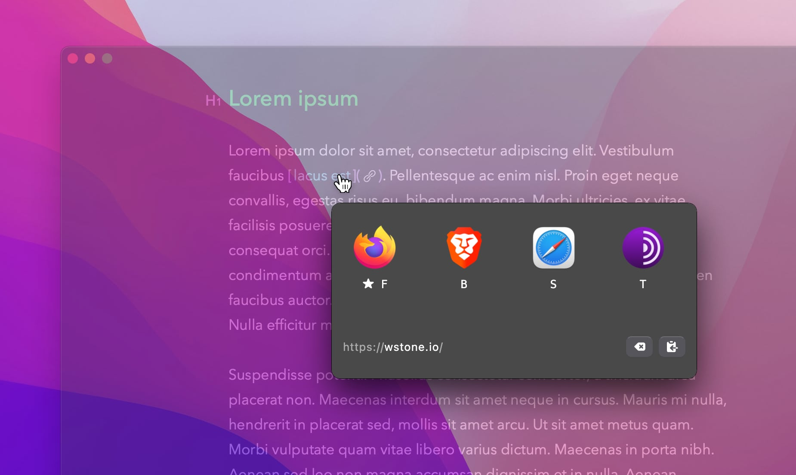

# Browserosaurus

Browserosaurus is an open-source (MIT license), browser prompter for macOS. It
works by setting itself as the default browser; any clicked links in non-browser
apps are now sent to Browserosaurus where you are presented with a menu of all
your installed browsers. You may now decide which app you’d like to continue
opening the link with.



## Installation

Download Browserosaurus from the
[GitHub releases page](https://github.com/will-stone/browserosaurus/releases/latest).
Select **x64** for Intel machines, or **arm64** for Apple Silicon (M1) machines.

Or use [Homebrew](https://formulae.brew.sh/cask/browserosaurus#default). Thank
you very much to [@i0ntempest](https://github.com/i0ntempest) and
[@tk4k](https://github.com/tk4k) for keeping this cask updated 🙏

```sh
brew install --cask browserosaurus
```

> 🚨 **Please note that Browserosaurus only officially supports the version of
> macOS that I currently use, see
> [here](docs/faq.md#which-is-the-supported-version-of-macos) for details.**

## Help

Found a bug? Please log an
[issue](https://github.com/will-stone/browserosaurus/issues). For anything else,
please see the documentation below or open a
[discussion](https://github.com/will-stone/browserosaurus/discussions).

## Documentation

- [Changelog](https://github.com/will-stone/browserosaurus/releases)
- [Frequently asked questions](docs/faq.md)
- [Supporting a new browser or app](docs/supporting-a-browser-or-app.md)
- [Setting up for development](docs/setting-up-for-development.md)

For the maintainer:

- [Creating menubar icon](docs/creating-menubar-icon.md)
- [Publishing](docs/publishing.md)
