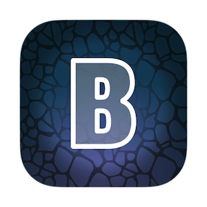

# Browserosaurus

If you enjoy using Browserosaurus, please consider supporting its continued
development.

Browserosaurus is an open-source (MIT license), Electron-based browser prompter
for macOS. It works by setting itself as the default browser; any clicked links
in non-browser apps are now sent to Browserosaurus where it’ll present you with
a menu of all your installed browsers. You may now decide which browser you’d
like to continue opening the link with.

**Currently supports macOS 11.4**

## Installation

Installation instructions and alternatives are available on
[https://wstone.io/browserosaurus](https://wstone.io/browserosaurus)

## Development

Ensure you are running the correct version of Node. The repo includes an
`.nvmrc` file that includes the version number I use.

Get repo:

```
git clone git@github.com:will-stone/browserosaurus.git
```

Move to folder:

```
cd browserosaurus
```

Install dependencies:

```
npm i
```

Run Browserosaurus in dev mode:

```
npm start
```

### Finding bundle identifier for an app

```sh
mdls -name kMDItemCFBundleIdentifier -r /Applications/Firefox.app
```

### Browser logos

The browser logos are provided by an excellent project by
[Cătălin Mariș](https://github.com/alrra):
https://github.com/alrra/browser-logos

### Make icon.icns

To build an icns file (app icon) from `src/shared/static/icon/icon.png`, simply
run `npm run icns`.

## Publishing

App is published on GitHub, the following command will prompt to bump version
number, package, notarize, and make installers:

```
npm run release
```

The dmg and zip files can then be added to a GitHub release.
