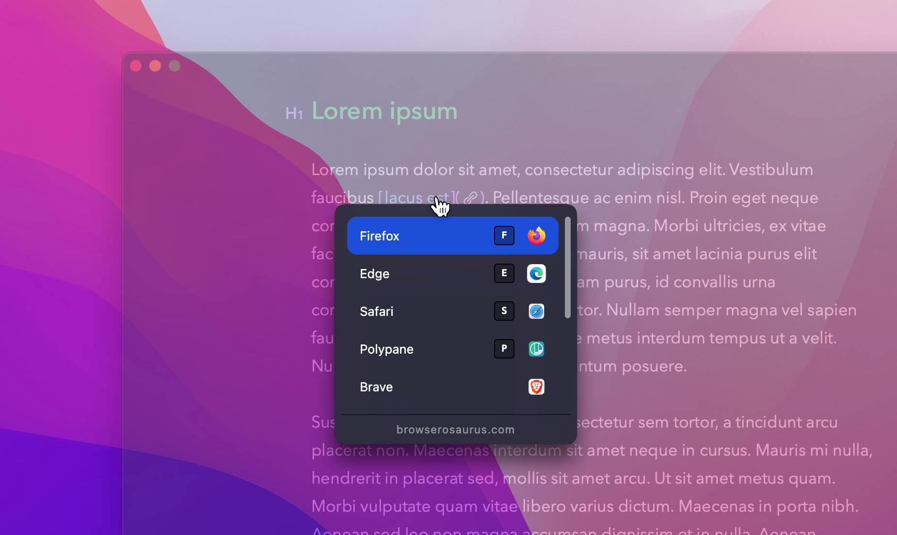

# Browserosaurus

Browserosaurus is an open-source (GPLv3 license), browser prompter for macOS. It
works by setting itself as the default browser; any clicked links in non-browser
apps are now sent to Browserosaurus where you are presented with a menu of all
your installed browsers. You may now decide which app you’d like to continue
opening the link with.



## Installation

Download Browserosaurus from the
[GitHub releases page](https://github.com/will-stone/browserosaurus/releases/latest).
Select **x64** for Intel machines, or **arm64** for Apple Silicon (M1) machines.

Or use [Homebrew](https://formulae.brew.sh/cask/browserosaurus#default). Thank
you very much to [@i0ntempest](https://github.com/i0ntempest) and
[@tk4k](https://github.com/tk4k) for keeping this cask updated 🙏

```sh
brew install --cask browserosaurus
```

> 🚨 **Please note that Browserosaurus only officially supports the version of
> macOS that I currently use, which you can assume to be the latest stable
> version.**

## Help

Found a bug? Please log an
[issue](https://github.com/will-stone/browserosaurus/issues). For anything else,
please see the documentation below or open a
[discussion](https://github.com/will-stone/browserosaurus/discussions).

## Projects inspired by Browserosaurus

Browserosaurus is primarily made for my needs and environment. Therefore, some
feature requests do not make it into the main project, but that's the beauty of
Open Source, you are free to copy the code and make your own tweaks (as long as
it remains open-sourced, of course, please see the license 😉). Here are some
forks of this project that you may like to consider:

- [Browseratops](https://github.com/riotrah/browseratops) by
  [@riotrah](https://github.com/riotrah). Browserosaurus but for **Windows**!
- [Browserino](https://github.com/AlexStrNik/Browserino) by
  [@alexstrnik](https://github.com/AlexStrNik). **Swift UI** port of
  Browserosaurus.

> Please PR your own fork to this list.

## Documentation

- [Changelog](https://github.com/will-stone/browserosaurus/releases)
- [Help](https://github.com/will-stone/browserosaurus/discussions/categories/q-a)
- [Supporting a new browser or app](guide/supporting-a-browser-or-app.md)
- [Setting up for development](guide/setting-up-for-development.md)
- [Privacy policy](guide/privacy.md)

For the maintainer:

- [Creating app icon](guide/creating-app-icon.md)
- [Publishing](guide/publishing.md)
