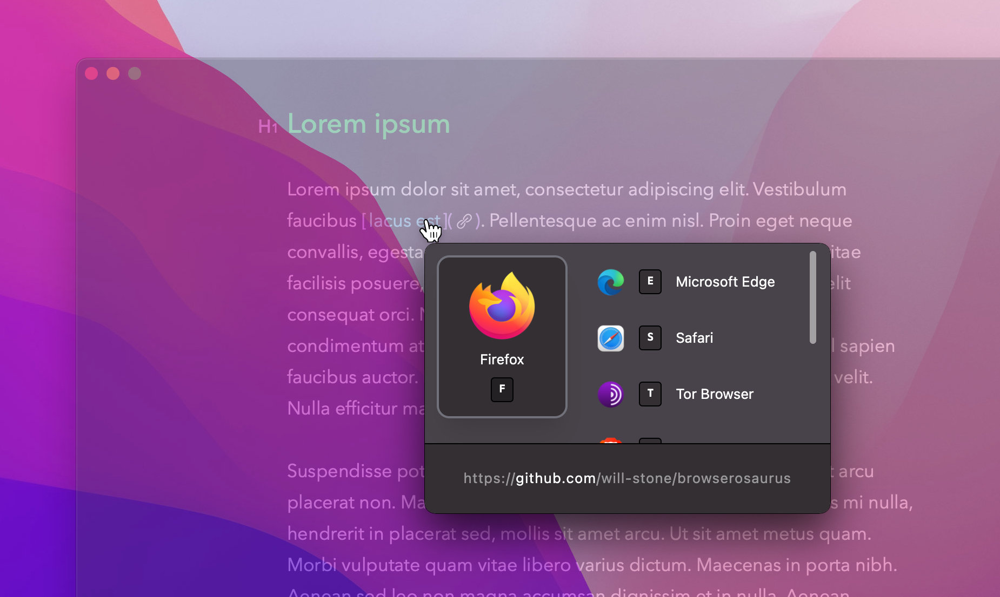

# Browserosaurus

Browserosaurus is an open-source (MIT license), browser prompter
for macOS. It works by setting itself as the default browser; any clicked links
in non-browser apps are now sent to Browserosaurus where you are presented with
a menu of all your installed browsers. You may now decide which app you’d like
to continue opening the link with.

---

---

## Installation

Please download Browserosaurus from the
[GitHub releases page](https://github.com/will-stone/browserosaurus/releases/latest).
Select **x64** for Intel machines, or **arm64** for Apple Silicon (M1) machines.

---

**Please note that Browserosaurus only officially supports the version of macOS
that I currently use, see [here](docs/faq.md) for details.**

---

## Documentation

- [Changelog](https://github.com/will-stone/browserosaurus/releases)
- [Frequently asked questions](docs/faq.md)
- [Adding a browser or app](docs/adding-browser-or-app.md)
- [Setting up for development](docs/setting-up-for-development.md)
- [Creating menubar icon](docs/creating-menubar-icon.md)
- [Publishing](docs/publishing.md)
